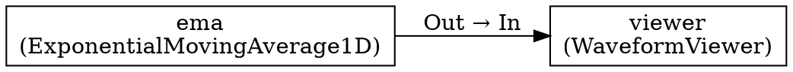

# Dump Graph Button - Test Guide

## Implementation Complete ✅

The "Dump Graph" button has been successfully implemented and is ready for testing.

### Changes Made

**Files Modified:**
1. `ami/flowchart/Editor.py` (+6 lines)
   - Added `actionDumpGraph` action definition
   - Added button to toolbar after "Home" button

2. `ami/flowchart/Flowchart.py` (+95 lines)
   - Added signal connection for button
   - Added `dumpGraphClicked()` handler method
   - Added `dumpFlowchartGraph()` implementation

**Total:** ~101 lines added

---

## How to Test

### Test 1: Basic Functionality

**Objective:** Verify the button works with a simple graph

```bash
ami-local random://
```

**Steps:**
1. In AMI GUI, add 2-3 nodes (e.g., ExponentialMovingAverage1D, WaveformViewer)
2. Connect them
3. Look for **"Dump Graph"** button in toolbar (after "Home", before "Pan")
4. Click **"Dump Graph"**

**Expected Results:**
- ✅ Status bar shows: "Graph dumped to flowchart_graph_YYYYMMDD_HHMMSS.dot"
- ✅ Console shows detailed logging:
  ```
  ================================================================================
  [Dump Flowchart Graph] Writing to flowchart_graph_20260318_103045.dot
    Nodes in self._graph: 2
    Edges in self._graph: 1
    ✅ Graph written using nx_pydot.write_dot
    ✅ Flowchart graph dumped to flowchart_graph_20260318_103045.dot
  ================================================================================
  ```
- ✅ File created in current directory with timestamp
- ✅ File contains nodes and edges in DOT format

**Verify Output:**
```bash
cat flowchart_graph_*.dot
```

Should show something like:


---

### Test 2: Subgraph Import (THE CRITICAL TEST!)

**Objective:** Debug missing internal edges issue

```bash
ami-local random://
```

**Steps:**
1. Tools → Manage Libraries
2. Load `export.fc` from subgraph library
3. Click "Apply"
4. Drag subgraph from library tree onto canvas
5. **IMMEDIATELY** click "Dump Graph" button → saves `flowchart_graph_001.dot`
6. Add a waveform source node
7. Connect: waveform.Out → combined.0.waveform.Out
8. Click "Dump Graph" again → saves `flowchart_graph_002.dot`

**Expected Results:**

**After Step 5 (before runtime connection):**
- File `flowchart_graph_001.dot` should contain:
  ```dot
  "ExponentialMovingAverage1D.0" -> "WaveformViewer.0" [label="Out → In"];
  "ExponentialMovingAverage1D.0" -> "ScalarPlot.0" [label="Count → Y"];
  ```
  
**After Step 8 (after runtime connection):**
- File `flowchart_graph_002.dot` should STILL contain those 2 internal edges
- PLUS the new runtime connection

**Analysis:**
- ✅ **If both dumps show internal edges:** Problem is in COMPILATION (not in flowchart graph)
- ❌ **If edges missing in dump 1:** Problem is in `_createSubgraph()` or import process
- ❌ **If edges disappear in dump 2:** Runtime connection corrupts internal edges

---

### Test 3: Compare with Compiled Graph

**Objective:** Identify where edges are lost

**After Test 2:**

Compare the flowchart graph with the compiled execution graph:

```bash
# Flowchart graph (pre-compilation)
cat flowchart_graph_001.dot

# Compiled execution graph (if you have it)
cat broken_graph.dot
```

**Key Questions:**
1. Are internal edges in flowchart graph? (from Test 2 dump)
2. Are internal edges in compiled graph? (broken_graph.dot)
3. Where are they lost? (import → flowchart → compilation)

---

### Test 4: Multiple Dumps (Before/After Operations)

**Objective:** Track graph changes over time

Use the dump button to snapshot the graph at different stages:

```bash
ami-local random://
```

**Workflow:**
1. Load/import subgraph → Dump → `flowchart_graph_001.dot`
2. Add nodes → Dump → `flowchart_graph_002.dot`
3. Make connections → Dump → `flowchart_graph_003.dot`
4. Disconnect → Dump → `flowchart_graph_004.dot`

**Compare files:**
```bash
diff flowchart_graph_001.dot flowchart_graph_002.dot
```

---

## Output File Format

The `.dot` files can be:
1. **Viewed as text:** `cat flowchart_graph_*.dot`
2. **Visualized with Graphviz:**
   ```bash
   dot -Tpng flowchart_graph_*.dot -o graph.png
   xdg-open graph.png
   ```
3. **Compared:** `diff graph1.dot graph2.dot`

---

## Troubleshooting

### Button Doesn't Appear
- Check AMI version is using modified code
- Verify Editor.py changes were applied
- Check console for errors on startup

### No File Created
- Check write permissions in current directory
- Look for error messages in console
- Check status bar for error message

### File is Empty or Malformed
- Check console logs for exceptions
- Verify `nx` (NetworkX) is available
- Try with a simple 2-node graph first

### ImportError about pydot
This is **not an error**! The code has a fallback:
- Tries `nx.drawing.nx_pydot.write_dot()` first
- Falls back to manual DOT writing if pydot unavailable
- Both produce valid `.dot` files

---

## Success Criteria

The implementation is working correctly if:

1. ✅ Button appears in toolbar
2. ✅ Clicking button creates timestamped `.dot` file
3. ✅ Status bar shows success message
4. ✅ Console shows detailed logging
5. ✅ File contains nodes from `self._graph`
6. ✅ File contains edges from `self._graph`
7. ✅ File is valid DOT format
8. ✅ Multiple dumps create unique filenames

---

## Next Steps After Testing

### If Test 2 shows edges ARE in flowchart graph:
→ **Problem is in compilation**, investigate:
- `ami/graphkit_wrapper.py` - How flowchart → execution graph
- `ami/graph_nodes.py` - Operation node conversion
- Node `to_operation()` methods

### If Test 2 shows edges MISSING in flowchart graph:
→ **Problem is in `_createSubgraph()` or import**, investigate:
- `_createSubgraph()` edge handling (lines ~400-550)
- `importSubgraphFromFile()` connection restoration (lines ~990-1050)
- Edge creation in `_discoverBoundaries()` or boundary processing

### If Test 2 shows edges disappear after runtime connection:
→ **Problem is in `nodeTermConnected()`**, investigate:
- Runtime connection handling
- Whether connecting to placeholder corrupts internal edges

---

## Files to Review After Testing

Depending on test results, review:

1. **Compilation path:**
   - `ami/flowchart/Flowchart.py:1749` - `saveState()` / graph compilation
   - `ami/graphkit_wrapper.py` - Execution graph building
   - `ami/graph_nodes.py` - Operation nodes

2. **Import path:**
   - `ami/flowchart/Flowchart.py:933` - `importSubgraphFromFile()`
   - `ami/flowchart/Flowchart.py:270` - `_createSubgraph()` (if Phase 2 implemented)
   - `ami/flowchart/Flowchart.py:202` - `_discoverBoundaries()` (if Phase 2 implemented)

3. **Runtime connection path:**
   - `ami/flowchart/Flowchart.py` - Search for `nodeTermConnected`
   - Connection handling for subgraph boundaries

---

## Clean Up After Testing

Once debugging is complete and issues are fixed:

```bash
# Remove test dump files
rm flowchart_graph_*.dot

# Optional: Remove the Dump Graph button from production
# (Or keep it as a useful debugging tool!)
```

---

**Status:** Implementation complete, ready for testing ✅  
**Time to test:** ~15 minutes  
**Critical test:** Test 2 (subgraph import edge tracking)
