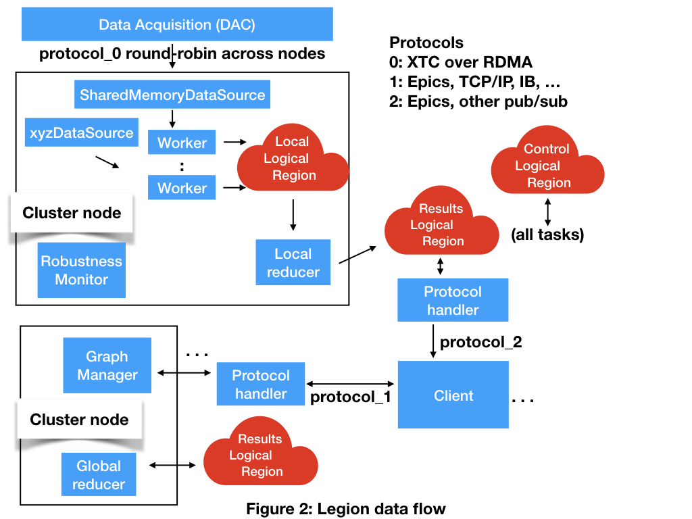

# Legion design

 
In the Legion design all of the components are Legion tasks except for the clients.
The stores are Legion logical regions.
The regions implements a [key-value store for JSON data](key_value_lr.md).

A custom mapper ensures that data sources and workers are mapped together on cluster nodes.
The event logical region is partitioned across the cluster nodes.
The Graph Manager and Robustness Monitors are mapped onto  a subset of cluster nodes.

Legion resilience mechanisms ensure that tasks always complete.
Logical Regions are persisted to disk and reloaded upon restart.
A system cron job ensures that Legion is always running.

## Event flow

The system is event driven and has no central thread of control.
Interactions between components are accomplished through data passed in logical regions and by futures.

## unresolved issues

How do protocols like Epics access data in and out of logical regions?

Is a Logical Region the right way to pass data from data sources to workers?

What is the right way to pass intermediate results from workers to local reducers?
