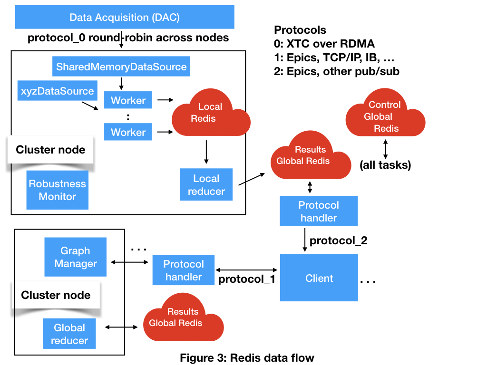

# Redis design

In the Redis design all of the components are separate processes.
The stores are implemented by the distributed resilient in-memory database Redis.
A local Redis runs privately on each node to support reductions.
A global distributed Redis runs across the cluster to provide data to manage Control and Results.

Event data is provided from a data source into a shared memory region.
When a worker gets event data it checks the Control Redis to see if there is a new computation graph.
If there is a new graph the worker retrieves it.
Then the worker runs the computation graph on the event data.
The worker stores the results in the local Redis where it can be accessed by the local Reducer.

## Schema

Each process that stores values in redis should have it keys prefixed by a specific string to help identify
that process's data. A proposed prefix is HOSTNAME:PROCESS_TYPE:ID. This schema shall be transparently enforced by the redis interface.

## Data Types

The following python types will be stored in redis:
* Bool
* Numpy arrays
* Critical state objects
* Computation graphs

In order to store numpy arrays, critical state objects, and computation graphs they must first be converted into binary strings via pickling.

Additionally, the graph manager will make use of a redis list as a queue in order to appropriately process requests from multiple clients
modifying a computation graph.

The redis interface will be responsible for transparently handling types.

## [Redis collections](https://github.com/honzajavorek/redis-collections)

A library which wraps redis types with a python interface. Currently supports: dict, list, set, counter, defaultdict, deque

Additionally implements LRUDict and SortedSetCounter. Provides Syncable versions of types which use context managers to wait until variable is out scope
to perform redis operations all at once. 

## Interface

Proposal: Wrap redis-py-cluster and implement the MutableMapping abstract base class interface. Syntactically this will allow for interactaction 
with redis through the normal python dictionary interface. Additionally, integrate support for redis-collections when its clear that the type being stored
directly maps to a redis type.
