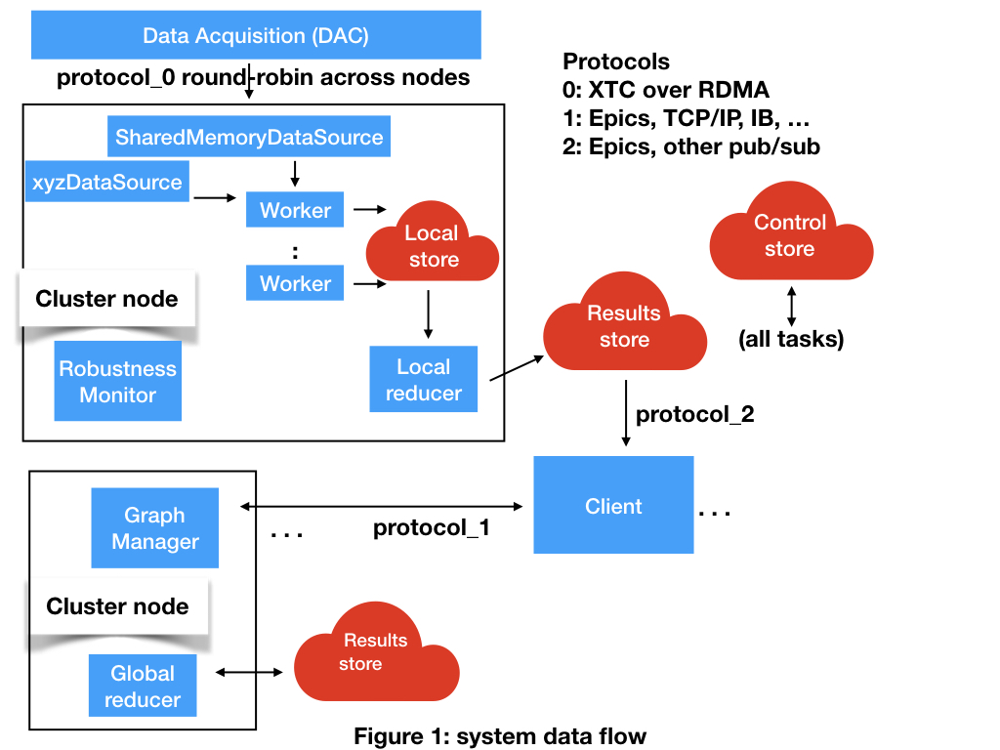

# Overview

AMI2 is a distributed visualization system for use with LCLS-II Free Electron Laser.
It is a rewrite of the previous AMI package.

There are two designs:
a [Legion based design](legion_design.md)
and a [Redis based design](redis_design.md).
The reason for two designs is that Legion is currently an experimental open source programming platform without
a guarantee of long term support.
The Redis design will incorporate existing stable open source software packages where appropriate.
The designs differ only in the back-end data processing pipeline.
[Clients](client.md) interact with the rest of the system through communication protocols and
are oblivious to the difference between the two backends.

[Testing](testing.md) is described here.

## Data flow
Please see Figure 1: system data flow.

Frames of event data enter the system through a Data Source.
At SLAC the SharedMemoryDataSource receives XTC events from the Data Acquisition system delivered by RDMA.
A FileDataSource drives the system in offline mode.
The system can be extended with new data sources (e.g. xyzDataSource).

A resilient distributed in-memory storage system (E.g. Redis, Legion) is used for the control and data planes.
Event data resides in a local store within a node.
Computational results and control signals reside in global stores.
Component heartbeats are monitored and failed components are automatically restarted.
Every component stores its volatile state in the resilient stores so it can reload that state when it restarts.

Each event is processed by a different worker.
Each cluster node supports multiple workers, typically one per core.
The cluster can be scaled to support arbitrarily high data rates.

The entire system is synchronized to the event timestamps.
Time is divided into intervals ccording to a desired user interface display rate, typically 20 Hz.
All results are maintained in bins according to the time interval in which they occur.

A worker processes an event by feeding the data to a computation graph which is a series of transformations.
The computation graph is defined by the Graph Manager according to requests from clients.
It is implemented as a python program that is maintained by the Graph Manager.
The worker sends outputs of the computation graph to the Local Reducer.
The worker only sends output at the desired display rate.
This results in a substantial reduction of the data rate compared to the original event data.

A Local Reducer receives outputs from a set of workers.
It repeats the (commutative) operations of the computation graph applied to the 
results from the workers.
For example, a worker may choose to compute the sum of a series of sensor images within a time interval.
The Local Reducer applies the computation graph operations to the outputs from workers on a single cluster node.

One or more Global Reducers combine results from Local Reducers.
Just like Local Reducers, Global Reducers apply the commutative operation of the computation graph to their inputs.
They produce an output back into the Results store.
While we anticipate that one Global Reducer will usually suffice, if the user-supplied code in the computation graph is slow then multiple Global Reducers may be required.

Clients may be GUIs, web browsers, devices, or file proxies.
Clients requests computations from the Graph Manager and subscribe to result channels from the global store.

## System Diagram

### Data Acquisition (DAC)
Data delivery events from sensors, distributed round-robin to nodes via Infiniband RDMA.

### DataSource
[DataSources](data_source.md) provide event data to the system.
#### SharedMemoryDataSource
Transfers incoming sensor data to the local store.
#### FileDataSource
Replays sensor data stored in a file.
#### xyzDataSource
User extended data source

### Worker
[Workers](worker.md) execute the computation graph on the event data and send the results to a Local Reducer.

### Local Reducer, Global Reducer
[Reducers](reducer.md) execute the computation graph on intermediate data and write the results to the Result store.
Local Reducers reduce results from workers on a local cluster node.
One or more Global Reducers reduce results across nodes from the Local Reducers.

### Graph Manager
[Graph manager](graph_manager.md) maintains the [computation graph](computation_graph.md).
May be replicated (not distributed) in a large scale system.
The graph definition is stored in the global Control store.

### Client
[Client processes](client.md) acquire data for visualization or control.
Clients may be based on Python/Qt, Web Browsers or Devices.
A FileClient is mainly useful for testing.

### Protocol handlers
Communication between the clients and GraphManager occurs over a [modular protocol](protocol.md).
#### Epics protocol
The Experimental Physics and Industrial Control System (EPICS) is a DOE labs protocol.
#### TCP/IP

### Robustness Monitor
The [Robustness Monitor](robust.md) monitors the state of the system and restarts failed component.

## Issues

### configuration changes
A barrier should flow through the data path when a system configuration is changed, eg changing the setting of a motor.
This can also serve as a data flush operation.

## Project Goals

Open Source package for Linux with an installer

[Robust to node or component failure, recover from crash](robust.md)

Scriptable, can log/control from logs/scripts

Multiple users can simultaneously edit the computation graph (at low rates)

Scalable to clusters of any size including supercomputers

Drive it online from shared memory event mechanism, or offline from a file

Portable, no Psana dependencies (or isolate them), hardware agnostic Linux/IA, any network

Follow well defined coding conventions, good project hygiene and testing

Extensible - new clients, new GUI elements, new Computation Graph operations, new data sources

Two versions, [one with Legion](legion_design.md) and [one with Redis](redis_design.md)

Support Epics protocol to send data to clients, also for clients to make requests

We do not assume a global file system.

